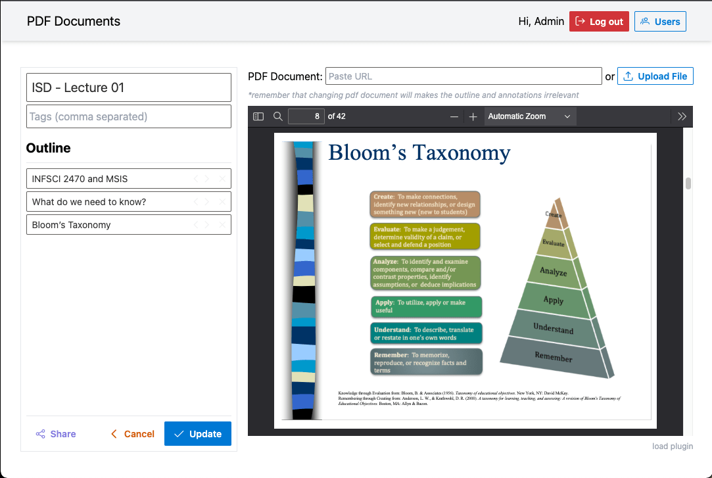

# PDF-Reader

a pdf-reader that support multiple type of annotations (highlight, underline, line-through, redact, freeform drawing - handwritten notes) or content embedding (video/audio/html/...). author is able to define a pdf document and share it with others (through configured links - which specifies what features should be available while reading). this pdf-reader can be used through iframe and interacted programatically through its api (browser messaging).

| __Author View__ | __Reader View__ |
|:--:|:--:|
|  |  |

## Components
- [PDF-Reader UI (Angular)](./pdf-reader/README.md)
- [PDF-Store Service (NestJS/MongoDB)](./pdf-store/README.md)

## Run in Docker
- [Run in Production/Docker](./docker/README.md)